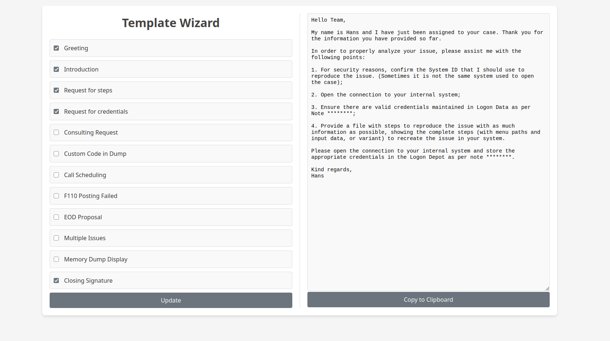

# Template Wizard



## Goals

Refactoring the CLI version([repo here](https://github.com/hansdf/template-wizard-cli)) into a more user friendly web page.

To-dos:
 - Add the copy to clipboard functionality similar to the CLI version.
 - Dynamically alter the names in greetings and closing signature without having to manually go into the JSON file.
 - Adding/modifying templates support???
 - Scroll bar for the template list
 - Dark mode


## Dockerfile

```docker build -t template-wizard .```

```docker run -p 8080:8080 template-wizard```